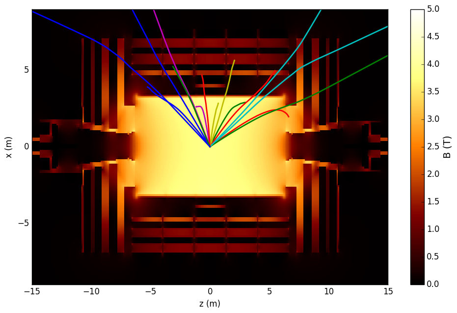
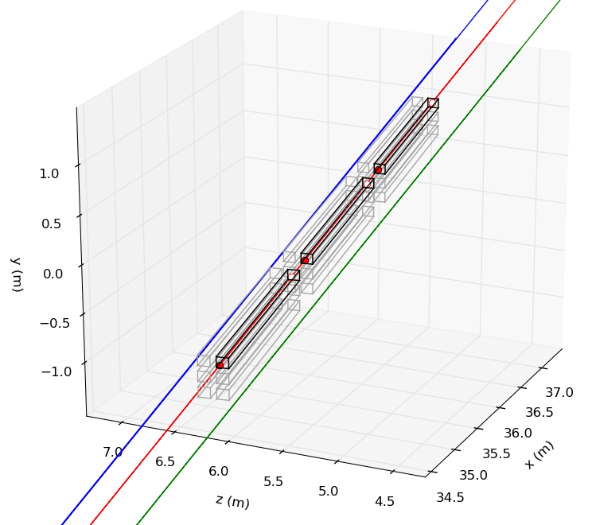

# MilliqanSim

## What is it?

A general-purpose particle trajectory simulator that can propagate a particle through a magnetic field, implement
basic multiple scattering and Bethe-Bloch energy loss, and generate statistics on the intersections of these trajectories
with an exernal plane (e.g., the Milliqan detector).

  

*Note on units and coordinates: throughout the software, units used are meters for distance, MeV for mass/momentum/energy, nanoseconds
for time, and electron-charge units for charge. Coordinates used are CMS coordinates, with the beamline being the z direction.*

## Dependencies and setup

The package is entirely written in Python (~~v 2.7~~ should now run in 2.7 and 3.x). The only absolute requirement is the [numpy](http://www.numpy.org) 
library. Optional but useful are the [matplotlib](http://matplotlib.org/) library to make plots, pyROOT to get input 
from or output to a ROOT file, and [numba](http://numba.pydata.org/) if you want to use the `fast_integrate` module to get
a ~100x speed up.

To setup, run `. setup.sh` from the main directory. This will properly set your PYTHONPATH environment variable
and check for the required packages.

To run a simple check that everything is working, you can go to the `test` directory and run `python validate_helix.py`.
This will propagate a particle through a uniform magnetic field and compare the trajectory with the expected helix.
You should see a plot of the x and y coorinates as a function of time.

More advanced tests are in `test/functionality_tests.py`. This will run through a few examples with muons
to test b-field propagation, multiple scattering, and Bethe-Bloch energy loss and visualize the results.

## Repository contents

The `millisim` directory is a python module with 5 submodules, which are imported into a user-written main script.
Examples of their use are in `test/functionality_tests.py`.

1. **Environment.py** - implements an `Environment` class that stores b-field/material configuration. Also contains constants defining material properties.
2. **Integrator.py** -  implements an `Integrator` class that controls the propagation of particles through a given `Environment`
3. **Detector.py** - contains classes implementing "Detectors". These take a trajectory as input and return information about the interaction of the particle 
with the detector. E.g., the location and direction of a particle upon intersection with a detector face. There is a simple `PlaneDetector`, which simply detects intersections of trajectories with a rectangle, and a more complicated `MilliqanDetector` that implements a full 3D bars layout, and can determine which bars a given trajectory hits.
4. **MatterInteractions.py** - methods implementing multiple scattering and Bethe-Bloch energy loss (used internally, probably don't need to touch in user script)
5. **Drawing.py** - various methods to make plots of trajectories

The `test` directory contains a few well-commented example scripts that should give a good idea of how to use the program. In addition
to the test scripts mentioned above, `milliqan_test.py` is a program to simulate particle hits (muons or mCPs) on a pseudo Milliqan detector (enlarged for demonstration purposes). This also shows how to retrieve information on the intersection of a trajectory with the Milliqan bars.

The `bfield` directory contains the pickled-version of the CMS magnetic field map. This is loaded into memory at the start
of the simulation. There is also a script to make a 2D plot of the field.

The `p_eta_dist` directory contains a sample root file with pT and eta distributions of hypothetical milli-charged particles.
This is used by `test/milliqan_test.py` to generate the initial kinematics of these particles.

## General instructions

For out-of-the-box use, you shouldn't have to edit any of the files in the `millisim` directory. Everything can be controlled from
the user-written main script. A few examples of these are in the `test` directory. You should start each script by defining an `Environment`
(with desired B-field and material setup), and then an `Integrator` that will propagate particles through this environment.
Configurable parameters for these classes are listed below:

**Environment** parameters:
1. `bfield`: one of `["none", "uniform", "updown", "cms"]`. `"uniform"` is a uniform 1 T field in the +z direction. `"cms"` will load the
CMS magnetic field map defined in the file provided to the next argument
2. `bfield_file`: the pickled file of arrays containg the CMS magentic field. Required if `bfield = "cms"` above. The map is located in `bfield/bfield_coarse.pkl`.
3. `mat_setup`: one of `["none", "sife", "cms"]`, or `"unif_"+mat_name`, where `mat_name` is any of the defined materials (for a uniform material).
`"cms"` is a very simplified model of CMS.
4. `interpolate_b`: whether to interpolate B-field values, or just use closest defined point (default `True`).
5. `use_fine_bfield`: configure to use a fine-binned B-field (used in the past, probably never needed anymore)
6. `rock_begins`: If using `mat_setup = "cms"`, this is the distance from the origin where a uniform `"rock"` material is assumed.

**Integrator** parameters:
1.  `environ`: an Environment class object through which to propagate particle
2.  `m,Q` : the mass and charge of the particle to propagate
3.  `dt, nsteps`: timestep (in ns) and maximum number of steps to simulate
4.  `cutoff_dist`: stop propagation early once it reaches this distance
5.  `cutoff_axis`: how to measure this distance. `'x','y','z'` for the x, y, z coordinates. `'r'` for `srqt(x^2+y2)`. `'R'` for `sqrt(x^2+y^2+z^2)`
6.  `multiple_scatter`: algorithm to use for multiple scattering. Can be one of `['none', 'pdg', 'kuhn']` (`'pdg'` is simple small-angle gaussian scattering
described in [this PDG chapter](http://pdg.lbl.gov/2019/reviews/rpp2018-rev-passage-particles-matter.pdf). `'kuhn'` is a more advanced algorithm that has
more realistic, larger tails in the scattering angle distribution ("Rutherford scattering"). Probably not necessary).
7.  `do_energy_loss`: simulate dE/dx energy loss
8.  `use_var_dt`: if this is `True`, then use a variable dt when velocity is low (when momentum < mass)
9.  `lowv_dx`: if use_var_dt is set, this is the fixed spatial displacement to use when recomputing dt (in m)
10. `update func`: if you want to specify a custom update function that computes dx/dt at each timestep
11. `randomize_charge_sign`: everytime 'propagate' is called, randomly flip sign of Q

You can also define a `Detector` object that will take a computed trajectory and return information. Currently the only
one implemented is `PlaneDetector`, which is a rectangular plane with normal vector pointing at the origin.

**PlaneDetector** parameters:
1. `dist_to_origin`: the distance from the face of the detector to the origin
2. `eta, phi`: the eta/phi of the center of detector face
3. `width, height`: the dimensions of rectagular. If either or both are `None`, that dimension is infinite

**MilliqanDetector** parameters:
1. `dist_to_origin`: the distance from the center of the near face of the detector to the origin
2. `eta, phi`: the eta/phi of the center of detector face
3. `nrows, ncols`: number of rows/cols of bars in each layer
4. `bar_width, bar_height, bar_length`: dimensions of bars
5. `bar_gap`: gap between bars within a single layer
6. `layer_gap`: gap between layers

Once you've defined everything, you can call the `Integrator.propagate` method to compute a particle trajectory. This implements a Runge-Kutta integrator
that will propagate a particle through the magnetic field, and simulates multiple scattering/energy loss if these are turned on.
The only argument is a 6-element vector `x0` that contains the initial position and momentum `[x, y, z, px, py, pz]` (as always, position is in meters and momentum in MeV).
At each timestep, the function `Integrator.update_func` is called (defaults to `Integrator.dxdt_bfield`) that computes dx/dt given the current time/position/momentum.
This is used to update the 6-element x vector. The change in position/momentum are modified to account for multiple scattering and energy loss if turned on
(multiple scattering is a random process, energy loss is deterministic).

The return value of `Integrator.propagate` is a 6-by-(nsteps+1) array. Each column contains `[x,y,z,px,py,pz]` at a specific timestep.

The `PlaneDetector.find_intersection` method takes the trajectory array defined above and computes statistics on the intersection with
an external plane, and returns a dictionary of useful values. `MilliqanDetector.find_entries_exits` returns the entry and exit points of a given trajectory for each bar it passes through. See `millisim/Detector.py` and `test/milliqan_test.py` for details.
